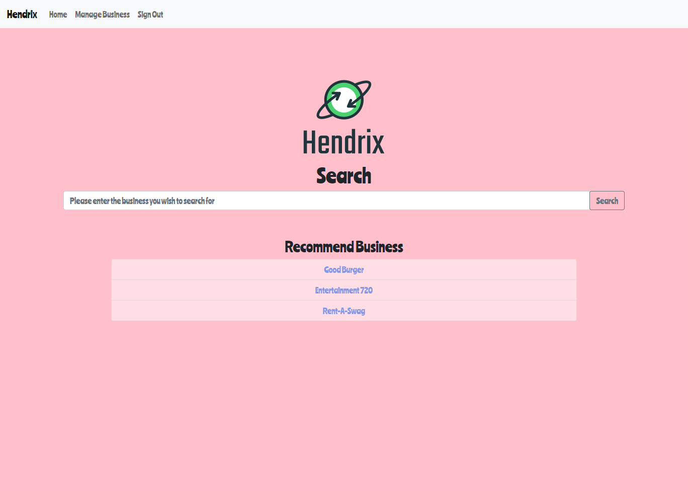
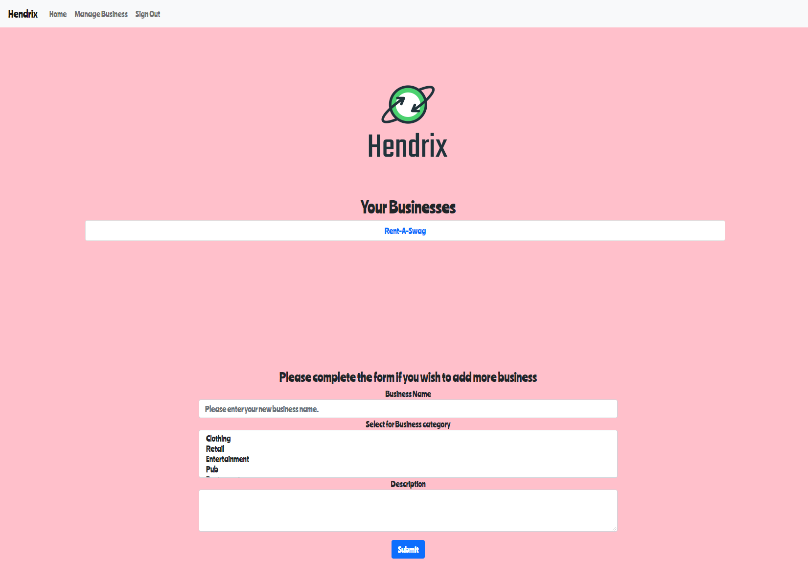
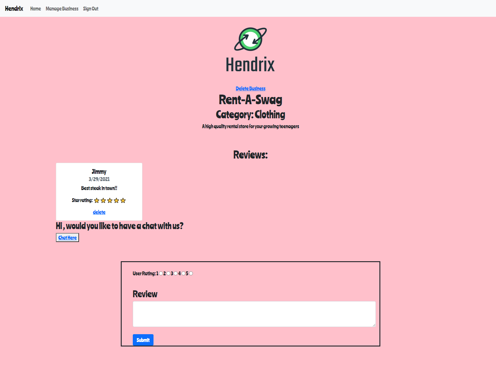

# Hendrix

## Table of Content
* [Project Links](#Project-Links)
* [Screenshots-Demo](#Screenshots)
* [Project Objective ](#Project-Objective)
* [Installation](#Installation)
* [Technologies](#Technologies)
* [Contact](#Contact)
* [License](#License)
## Project Links
[Github Repo](https://github.com/silvia-taliana/review-web)

[Heroku Deployment](https://powerful-cliffs-81150.herokuapp.com/)
## Screenshots - Demo

## Project Objective
Working with a team of developers, we set out to create an application incorporating a MVC and a mySQL server.
The main purpose of this application is to provide a platform for businesses to not only promote their pages but for consumers to voice their opinions of their service.
The website allows business owners and consumers to create accounts and freely post reviews.

Design process:
-      Brainstorming an idea
-      Designing database models
-      Designing page format
-      Linking routes and fetch requests for a responsive website
-      Creating a chat room via the use of socket.io

## Installation
This is a web based application which is already deployed at heroku.

## Technologies
-      mySQL
-      Javascript
-      Handlebars
-      Sequelize
-      socket.io

## Future Development
-      Allow for users to privately chat with business owners.
-      Create maps with businesses location
-      A form of booking restaraunts/pubs
## Author Contact
Contact the author with any questions! 
Github link: [Travis](https://github.com/Travis297)
Github link: [Silvia](https://github.com/silvia-taliana)
Github link: [Shelly](https://github.com/zoeshelly-tan)
Github link: [Suri](https://github.com/netsy001)
## License
This project is [MIT](https://choosealicense.com/licenses/MIT/) licensed.
